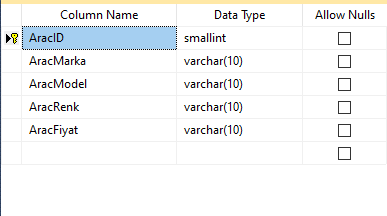
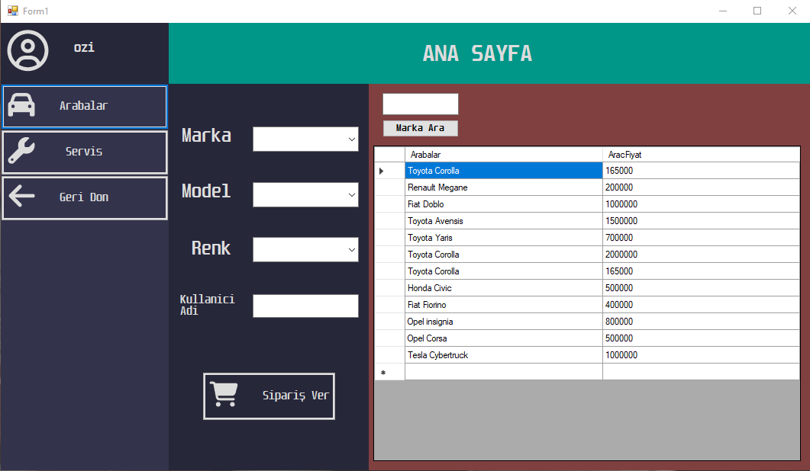
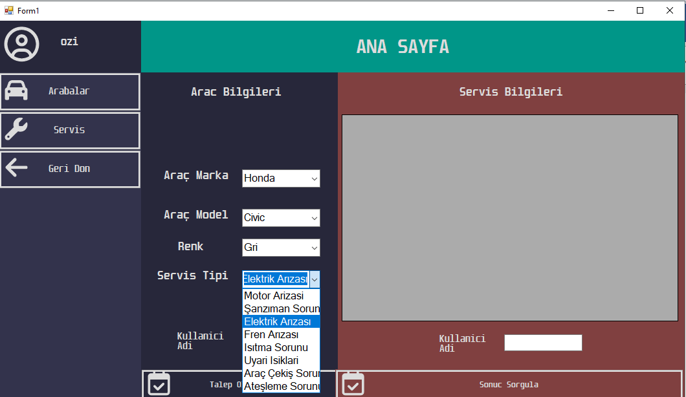
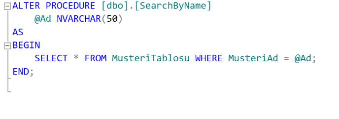

First of all, I made the necessary analyzes. I made a list of which
tables are
needed.

After making a few additions, I decided on the tables to be created.
Then we drew the ER Diagram before creating these tables, this task was
undertaken by my friend Ender.

Then I created the tables and drew the Database schema.

Then I started making form designs.

Home Screen :

The screen that appears when we press the login button:

Registration panel :

The panel that comes when we log in:

This is the image that comes when I click on the Cars tab. I added a
query that lists the cars report on the right side by brand and I used
Stored Procedure here.

On the left side is the order panel. In the order panel, I added our
vehicle's Brand, Model, Color and username query as a security question.

When we click on the "Place order" button, our order is created.

The panel that appears when we click on the service button. On the left
side there is a panel for us to create an appointment request.

This is the image that appears when we click the create request button.
I joined two tables using inner join to reflect two different tables to
a single datagridview

The appointment we receive on the left side looks like this After
evaluating the condition of the vehicle, the remaining information will
be entered by the admin (Price, Delivery Date, Result)

(After Entry)

Now let's look at the admin panel. First of all, when we log in with a
username called admin, the admin panel tab welcomes us. We have various
buttons on the side, these are Cars, Service, Customers, Backup, Sales
and Exit

First of all, let's start with the Cars panel. This is how the panel
looks like. There are Add Car, Update Price and Remove Car Buttons.

When we press the Add Car button, this form welcomes us, after entering
the car properties we want, when we press the add button, our car is
added. I used the Insert query in this section.

If we enter the desired information, the vehicle is added to our table.

When we press the Update Price button, this form welcomes us.

We enter the new price of our vehicle by selecting the values in the
comboboxes and the price of our vehicle has changed.

Finally, with the Delete query, the car with the selected id is deleted
and then the deleted vehicle is added to the Deleted Cars Table with the
trigger I wrote, and the Deleted Cars button shows us this table.

In the service part, we manually enter the missing information in this
way, that is, the date on which our vehicle will leave the service, the
service price and the service result. And the values we enter are added
to the table, here I used the update query.

In the customers section, I added 2 listing methods, one according to
the name we entered and the other according to all customers. In the all
customers section, I used the customer table directly in the customer
table and the stored procedure in the according to the name section.

When we click on the button, I wrote a code that saves the database with
.bak extension to the backups folder in C. I think I will add a return
from backup button as soon as possible.

The sales section is a report that shows how many vehicles sold in
total. I wrote a stored procedure in this section.

In the procedure I wrote, I asked the Sales table to count the total
number of that vehicle model in the Sales table and assign it to the
table named TotelSales, and I created a table containing the vehicle
model and total sales columns.

Back buttons take us to the Login form.

I will try to add the options to save the data as pdf and assign the txt
file to the table as soon as possible.
